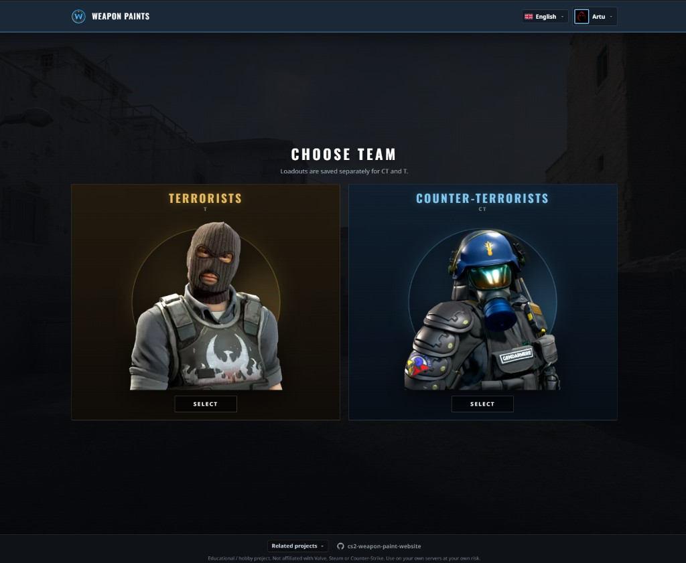
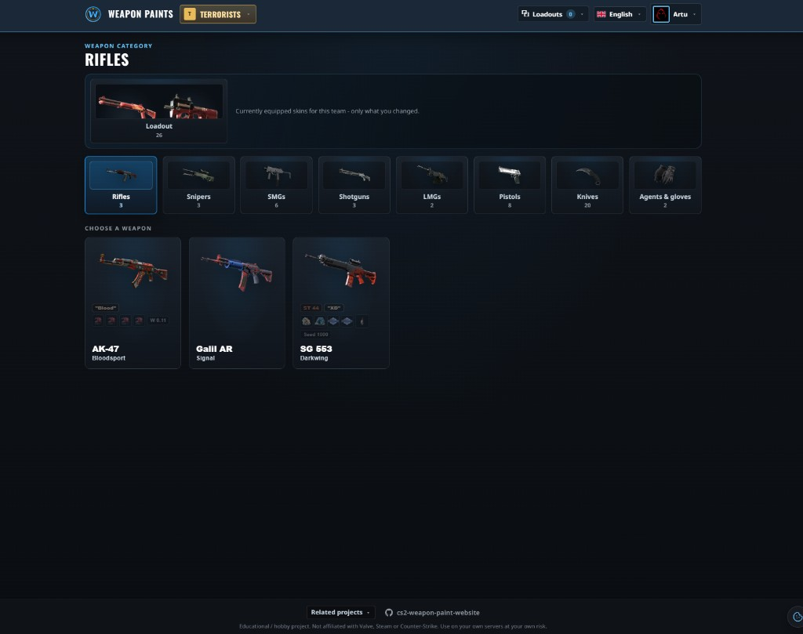
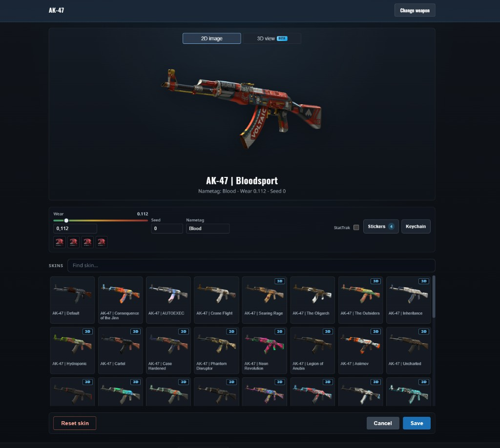
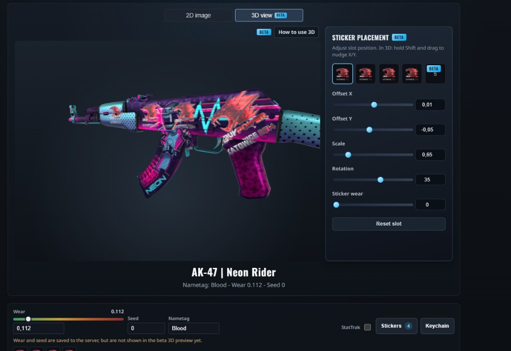
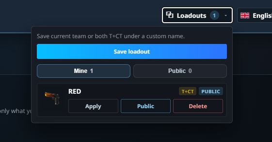
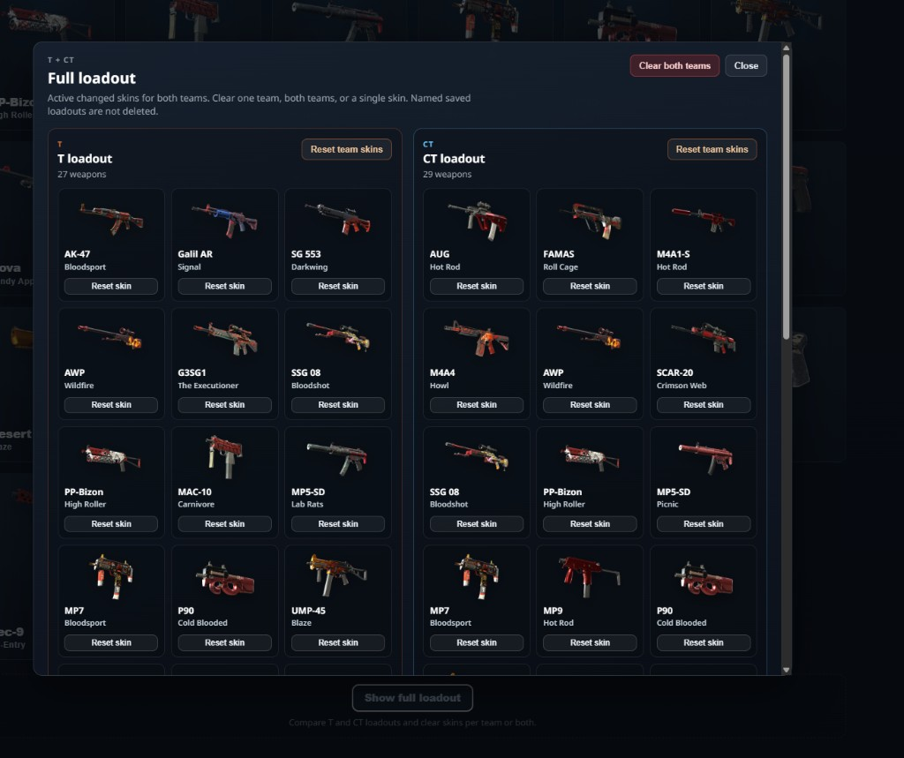
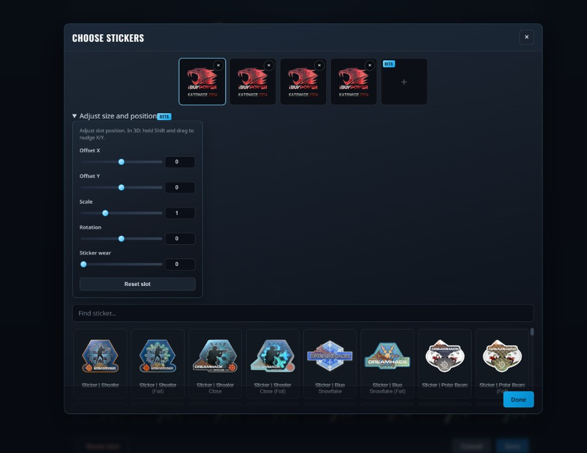
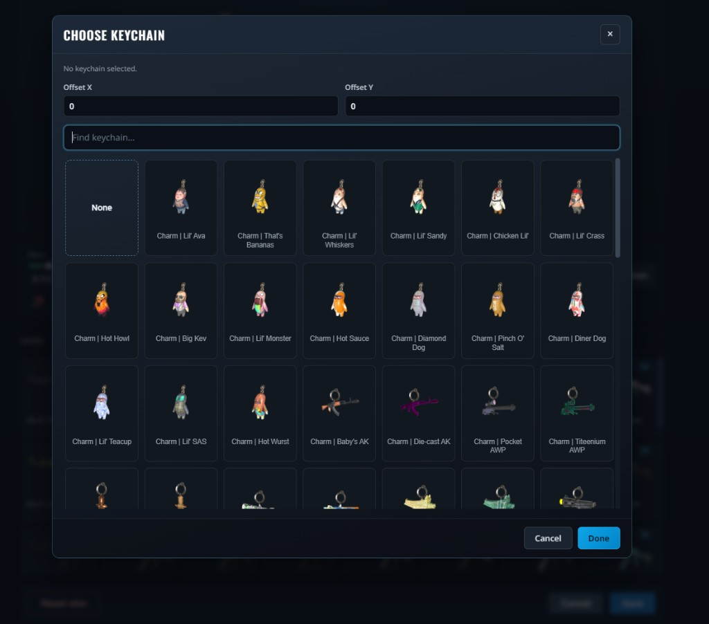
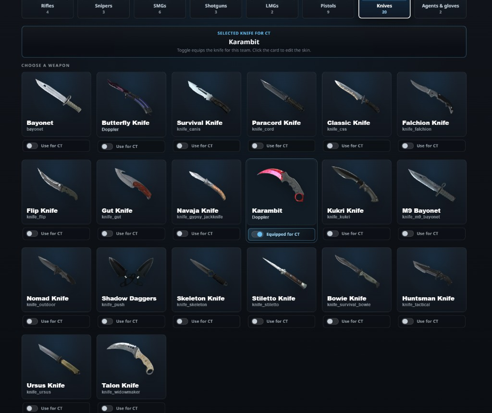

# CS2 Weapon Paints Website

React + Vite frontend and PHP backend for customizing Counter-Strike 2 weapon skins on your own servers. Works with the [CounterStrikeSharp Weapon Paint plugin](https://github.com/Nereziel/cs2-WeaponPaints/tree/main/server).

Educational / hobby project. Not affiliated with Valve, Steam, or Counter-Strike. Use on your own servers at your own risk.

Based on and extended from [Nereziel/cs2-WeaponPaints](https://github.com/Nereziel/cs2-WeaponPaints) (weapon/sticker/keychain data and images).

## Demo

Live demo: [https://skins.vxh.pl/](https://skins.vxh.pl/)

## Screenshots

Screenshots live in the repo under [`readme/`](readme/) so they stay with the project.

### Choose team



### Weapon categories and cards



### Skin customizer (2D)



### Skin customizer (3D, beta)



### Saved loadouts



### Full loadout (T + CT)



### Stickers (size and position)



### Keychains



### Knives



## Features

- Steam OpenID login; skins stored per SteamID
- Separate loadouts for T and CT
- Skins: paint, wear, seed, nametag, StatTrak
- Stickers (5 slots, 5th beta): offsets, scale, rotation, wear
- Keychains with X/Y offsets
- Knives, agents, gloves
- Named saved loadouts (team or both); optional public copy
- Full loadout view: compare T/CT, reset skin/team/both
- Optional beta 3D preview (`BETA_3D`)
- i18n: English, Polish, German, French, Russian, Ukrainian
- PWA-ready frontend assets

## Structure

```
/
  frontend/     React (Vite) UI
  backend/      PHP API, Steam auth, MySQL
  readme/       README screenshots (tracked in git)
  scripts/      Dev helpers (plugin data, 3D manifest, …)
```

Config template: `backend/config.sample.php` (copy to `config.php`, never commit secrets).

## Production setup

1. Download the latest [release](../../releases) (prebuilt frontend + `api/` PHP backend), **or** build locally with `pnpm release` (writes ready-to-upload `releases/newest-release/` folder).
2. Copy `api/config.sample.php` to `api/config.php` and set:

- Steam Web API key
- Domain name
- MySQL host, port, database, user, password

3. Upload the contents of `releases/newest-release/` to your host document root (or a subdirectory).
4. Open your domain over HTTPS.

Requirements: PHP with PDO MySQL, HTTPS, writable session storage under the API.

No frontend build step is required for the release folder.

## Local development

Prefer **pnpm**.

1. Backend config:

```bash
cp backend/config.sample.php backend/config.php
```

Edit Steam key, domain, and DB settings.

1. Frontend API URL (example):

```bash
cp frontend/.env.sample frontend/.env.development
```

Set `VITE_API_URL` to your local API (for example `http://127.0.0.1:8080/`).

1. Install and run:

```bash
pnpm install
pnpm --dir frontend install
pnpm dev
```

Or separately:

```bash
pnpm dev:backend    # PHP on 127.0.0.1:8080
pnpm dev:frontend   # Vite (default http://localhost:5173)
```

Use `http://localhost:5173` so the session cookie works with the API.

Optional beta 3D in `backend/config.php`:

```php
define('BETA_3D', true);
```

Optional HTTP to HTTPS redirect:

- `SSL_REDIRECT` in `config.php` only covers **PHP API** (`/api/…`).
- Whole-site redirect (HTML + assets) is in `frontend/public/.htaccess` (copied into release root). On shared hosting that is usually what you need for `http://…` → `https://…`.

```php
define('SSL_REDIRECT', true);
```

Optional API protection (defaults apply if omitted):

```php
define('API_RATE_LIMIT', 120);      // requests / window (0 = off)
define('API_RATE_WINDOW', 60);      // seconds
define('API_READ_CACHE_TTL', 5);    // skip MySQL for identical reads (0 = off)
```

Cache build id (`backend/storage/cache/CACHE_VERSION`) is bumped automatically by `pnpm dev` and `pnpm release`, which also wipes PHP read/rate-limit cache files. Manual: `pnpm cache:bump`.

## Steam auth

- Login via `backend/steamauth/`
- Session cookie: `wp_session` (HttpOnly)
- Logout: `steamauth/logout.php`
- Player skins: `wp_player_skins` (and related knife/gloves/loadout tables)

## Data and images

Weapon definitions, stickers, keychains, and many skin images come from [Nereziel/cs2-WeaponPaints](https://github.com/Nereziel/cs2-WeaponPaints). Rights belong to Valve, Nereziel, and other respective owners.

Helper scripts (from repo root):

- `pnpm plugin:update` - fetch/sync plugin data
- `pnpm textures:manifest` - 3D texture availability manifest

## Legal

- Educational / hobby use only
- Not affiliated with Valve or Steam
- Do not use to bypass in-game purchases or monetization
- Run only on servers you control
